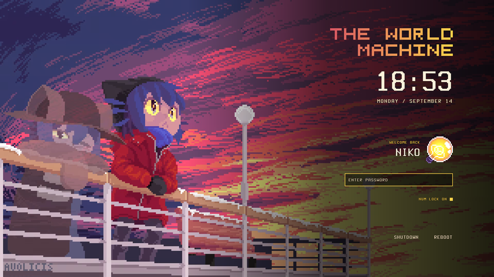
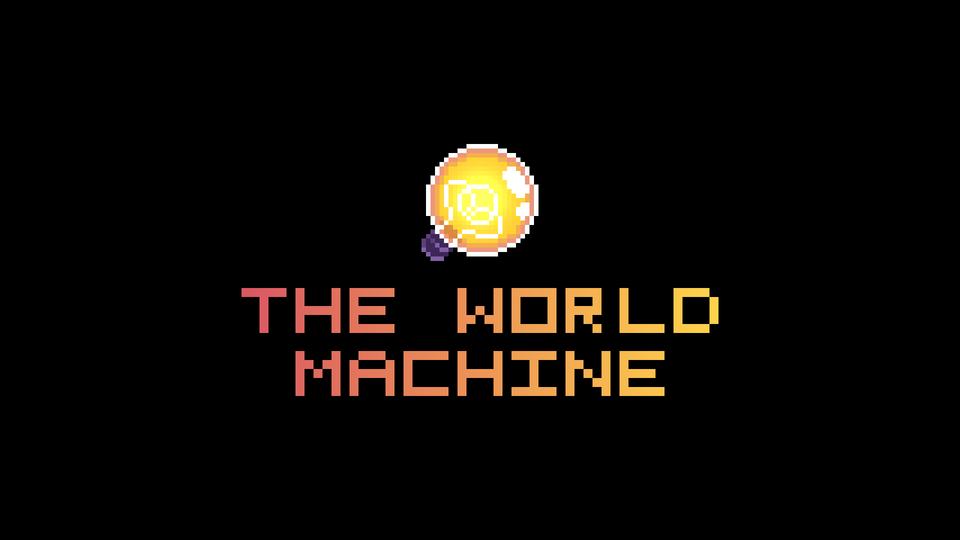

# OneShot-themed Ryoku

THE WORLD MACHINE look for [Ryoku](https://github.com/ryoku-dev): a lock screen, a
shell reload screen, and a boot screen.

| Lock screen | Shell reload | Boot screen |
| --- | --- | --- |
|  |  |  |

## Install

The lock screen is on **RyoStore**: open Ryoku Settings > Lockscreen and install
**World Machine**. The installer below adds the reload and boot screens too, and
it leaves a Store-installed lock screen alone.

```bash
curl -fsSL https://raw.githubusercontent.com/CratusGod/Oneshot-themed-Ryoku/main/install.sh | bash
```

It installs all three parts. It asks before anything that needs your password.

Only want one part? Add `--lock`, `--reload` or `--boot`:

```bash
curl -fsSL https://raw.githubusercontent.com/CratusGod/Oneshot-themed-Ryoku/main/install.sh | bash -s -- --lock
```

Want to see what it would do first? Add `--dry-run`.

## Remove

```bash
curl -fsSL https://raw.githubusercontent.com/CratusGod/Oneshot-themed-Ryoku/main/uninstall.sh | bash
```

This puts the stock Ryoku look back.

## What each part does

- **Lock screen:** adds the `world-machine` theme, then asks to turn it on for the lock
  screen and the login screen. The video plays with music on the lock screen. The login
  screen is silent.
- **Shell reload:** sets the screen you see while the desktop restarts. If a reload
  fails, the failed screen uses the same wordmark.
- **Boot screen:** swaps the logo on the boot splash and rebuilds your initramfs. A
  pacman hook keeps it after Ryoku updates.

## Notes

- Made for 1920x1080. Other sizes work, but the layout is tuned for 1080p.
- Close Ryoku Settings before installing the shell reload part. Saving in Settings
  would undo it.
- Survives `ryoku update`. Nothing here edits Ryoku's own files except the boot logo,
  and the pacman hook puts that back.
- `tools/build.sh` rebuilds the wordmark art in other colours:
  `MODE=cover tools/build.sh '#D95763' '#FFD34A' out.png`

## Credits

- OneShot and Niko belong to Future Cat. This is a fan project, not affiliated with Future Cat.
- Background animation "Memory of a Distant Place" by
  [Avolicis](https://www.youtube.com/watch?v=eHxaYojFgl8), used with the artist's
  permission for this free, non-commercial theme.
- Lightbulb sprite: a free-to-use OneShot lightbulb, original author unknown.
- "THE WORLD MACHINE" pixel wordmark: original, by CratusGod.
- Font: Terminus (Terminess Nerd Font), SIL Open Font License, see
  `lockscreen/world-machine/font/LICENSE-Terminus.txt`.
- Lock screen layout started from the Last of Us theme in
  [qylock](https://github.com/Darkkal44/qylock).
- Code is GPL-3.0, like the qylock theme it started from. See `LICENSE`.
